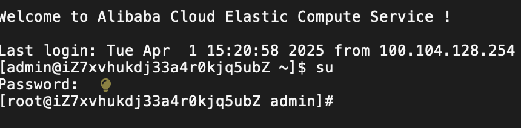

## 标识符$ 和 \# 的区别



## 分别以 root 和 admin 身份执行`ls -al`

```bash
[root@iZ7xvhukdj33a4r0kjq5ubZ ~]# ls -al
total 60
dr-xr-x---.  6 root root 4096 Mar 31 11:31 .
dr-xr-xr-x. 20 root root 4096 Mar 31 11:30 ..
-rw-------   1 root root    9 Apr  1 15:30 .bash_history
-rw-r--r--.  1 root root   18 May 18  2020 .bash_logout
-rw-r--r--.  1 root root  176 May 18  2020 .bash_profile
-rw-r--r--.  1 root root  176 May 18  2020 .bashrc
drwxr-xr-x   3 root root 4096 Dec 25 15:04 .cache
-rw-r--r--.  1 root root  100 May 18  2020 .cshrc
-rw-------   1 root root   52 Dec 25 17:23 .lesshst
drwxr-xr-x   2 root root 4096 Nov  4 10:05 .pip
-rw-r--r--   1 root root   72 Nov  4 10:05 .pydistutils.cfg
drwx------   2 root root 4096 Mar 31 11:30 .ssh
drwxr-xr-x   2 root root 4096 Mar 31 11:31 .swas
-rw-r--r--.  1 root root  129 May 18  2020 .tcshrc
-rw-r--r--   1 root root  285 Dec 25 17:22 .wget-hsts
[root@iZ7xvhukdj33a4r0kjq5ubZ ~]# exit
logout
[admin@iZ7xvhukdj33a4r0kjq5ubZ ~]$ ls -al
total 28
drwx------  3 admin admin 4096 Mar 31 11:36 .
drwxr-xr-x. 4 root  root  4096 Mar 31 11:30 ..
-rw-------  1 admin admin 1413 Apr  1 15:20 .bash_history
-rw-r--r--  1 admin admin   18 Oct 31 10:06 .bash_logout
-rw-r--r--  1 admin admin  141 Oct 31 10:06 .bash_profile
-rw-r--r--  1 admin admin  376 Oct 31 10:06 .bashrc
drwxr-xr-x  2 admin admin 4096 Mar 31 11:30 .ssh
```
