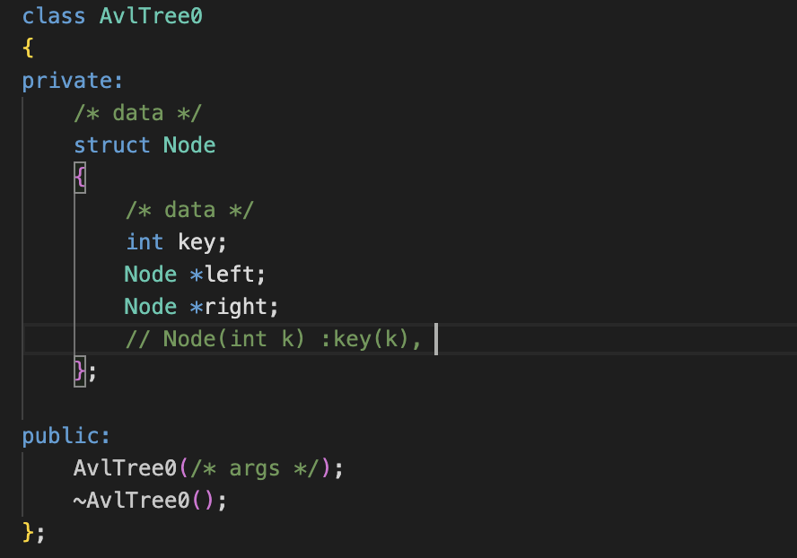

## 说说 const int *a, int const *a, const int a, int *const a, const int *const a 分别是什么，有什么特点。

在 C/C++中，`const`关键字的位置决定了它是修饰指针本身还是指针指向的数据。以下是对各表达式的详细解释和修正：

### 1. `const int *a` 和 `int const *a`

- **含义**：两者等价，均为**指向常量整数的指针**。
- **特点**：
  - 不能通过指针`a`修改所指向的整数值（如`*a = 5`会报错）。
  - 指针本身可以指向其他地址（如`a = &b`是允许的）。
- **示例**：
  ```cpp
  int x = 10;
  const int *a = &x;
  // *a = 20;  // 错误：无法修改指向的值
  a = &y;      // 正确：指针可以指向新地址
  ```

### 2. `const int a`

- **含义**：声明一个**常量整数**。
- **特点**：
  - `a`的值初始化后不可修改。
- **示例**：
  ```cpp
  const int a = 5;
  // a = 10;   // 错误：常量不可修改
  ```

### 3. `int *const a`

- **含义**：**常量指针，指向整数**。
- **特点**：
  - 指针的地址不可变（如`a = &b`会报错）。
  - 可以通过指针修改指向的整数值（前提是目标非`const`）。
- **示例**：
  ```cpp
  int x = 10;
  int *const a = &x;
  *a = 20;    // 正确：修改指向的值
  // a = &y;  // 错误：指针地址不可变
  ```

### 4. `const int *const a`

- **含义**：**常量指针，指向常量整数**。
- **特点**：
  - 指针的地址不可变。
  - 不能通过指针修改指向的值。
- **示例**：
  ```cpp
  const int x = 10;
  const int *const a = &x;
  // *a = 20; // 错误：指向的值不可修改
  // a = &y;  // 错误：指针地址不可变
  ```

### 关键修正说明

1. **`int *const a`的描述修正**：

   - 原描述“a 的值可以更改，但指向它的指针不能更改”存在歧义。正确理解为：
     - **指针的地址（值）不可变**（如`a = &b`错误）。
     - **指向的数据可以修改**（如`*a = 5`允许，前提目标非`const`）。

2. **`const int *const a`的补充**：
   - 需要确保指向的数据类型匹配。若指向`const int`，则不能通过该指针修改数据；若指向非`const int`，则其他途径可能修改数据，但该指针仍不可修改。

### 总结表格

| 表达式               | 指针可变性 | 指向数据可变性 | 描述                     |
| -------------------- | ---------- | -------------- | ------------------------ |
| `const int *a`       | ✔️         | ❌             | 指向常量的指针           |
| `int const *a`       | ✔️         | ❌             | 同上                     |
| `const int a`        | -          | ❌             | 常量整数                 |
| `int *const a`       | ❌         | ✔️             | 常量指针，指向非常量整数 |
| `const int *const a` | ❌         | ❌             | 常量指针，指向常量整数   |

---

## 如何理解（\*）

在 C/C++ 中，`*` 符号在指针中有两种不同的作用，具体取决于上下文：

---

### 1. **指针声明中的 `*`**

当 `*` 出现在变量声明中时，它表示**该变量是一个指针**，指向某个类型的值。例如：

```cpp
int *a;  // a 是一个指针，指向 int 类型的数据
```

#### 错误示例：`int *a = 5`

- **问题**：`5` 是一个整数值，而 `a` 是一个指针（内存地址），不能直接将整数赋值给指针。
- **正确做法**：指针应指向一个有效的内存地址，例如：
  ```cpp
  int b = 5;     // 定义一个整数变量 b，值为 5
  int *a = &b;   // a 存储的是 b 的地址（&b 是取地址操作）
  ```

---

### 2. **指针解引用中的 `*`**

当 `*` 出现在表达式中时，它是**解引用操作符**，表示访问指针指向的内存中的值。例如：

```cpp
int b = 5;
int *a = &b;
cout << *a;  // 输出 5（通过 a 访问它指向的地址中的值）
```

---

### 关键问题解析：`int *a = 5`

#### (1) `a` 是什么？

- `a` 是一个指向 `int` 类型的指针。
- 但 `int *a = 5` 的写法是错误的，因为 `5` 是一个整数，而指针需要的是一个内存地址。
- **正确用法**：必须让指针指向一个有效的地址：
  ```cpp
  int b = 5;
  int *a = &b;  // a 存储的是 b 的地址（比如 0x7ffeeb7c7b54）
  ```

#### (2) `*a` 是什么？

- `*a` 是解引用操作，表示访问指针 `a` 指向的内存中的值。
- 如果 `a` 正确指向一个整数变量（如 `int b = 5`），则 `*a` 的值是 `5`。

---

### 常见错误与修正

#### 错误代码

```cpp
int *a = 5;  // 错误：将整数 5 赋值给指针（类型不匹配）
```

#### 修正代码

```cpp
int b = 5;     // 定义一个整数变量
int *a = &b;   // a 指向 b 的地址
cout << *a;    // 输出 5（通过 a 访问 b 的值）
```

---

### 特殊场景：强制将整数作为地址

如果非要让指针指向一个固定的内存地址（如嵌入式开发中访问硬件寄存器），需要显式类型转换：

```cpp
int *a = (int*)0x1000;  // a 指向内存地址 0x1000
```

- **风险**：直接操作内存地址可能导致程序崩溃或未定义行为，需谨慎使用。

---

### 总结表格

| 表达式        | 含义                             | 正确性           |
| ------------- | -------------------------------- | ---------------- |
| `int *a`      | 声明一个指向 `int` 的指针        | 合法             |
| `int *a = 5`  | 错误：将整数赋值给指针           | 非法（需修正）   |
| `int *a = &b` | 正确：让指针指向变量 `b` 的地址  | 合法             |
| `*a`          | 解引用，访问指针指向的内存中的值 | 合法（需初始化） |

---

### 理解技巧

1. **指针是地址**：指针变量存储的是内存地址，而非直接的值。
2. **`*` 的双重角色**：
   - 声明时：`int *a` → `a` 是指针。
   - 使用时：`*a` → 访问指针指向的值。
3. **初始化指针**：始终让指针指向有效的内存（如变量地址、动态分配的内存）。

## 宏定义 与 const 常量有什么关系

1. 发生时机
   宏定义是在预处理时
   const 常量在编译时

2. 类型检查
   宏定义是没有类型检查，只是做了简单的字符串替换。虽然也有编译阶段，但会把报错时机延长到运行时
   const 是有类型检查，更安全一些

## new/delete 表达式

### malloc/new 的底层实现？

### free(p) 如何判断回收多少空间

### 野指针、内存泄漏、内存踩踏

### 频繁调用 malloc/free 会产生什么问题

### malloc/free 与 new/delete 的区别是什么

### 内存泄漏的检查工具 valgrind

##


注释 ** // Node(int k) :key(k),** 的时候，下面的 ~AvlTree0();不会报错，为什么？

## C++中 struct 和 class 有什么区别？

1. struct 的功能被拓展了，几乎和 class 一样
2. struct 默认访问权限是 public，而 class 是 private

## 对象的创建

C++中，对象的创建会调用一个特殊的函数：构造函数
作用：初始化数据成员
形式：
没有返回值，与类名相同，再加上参数列表
