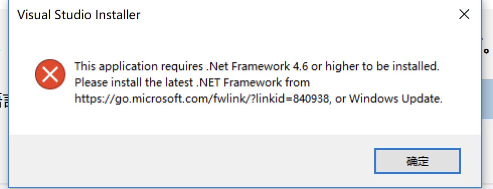
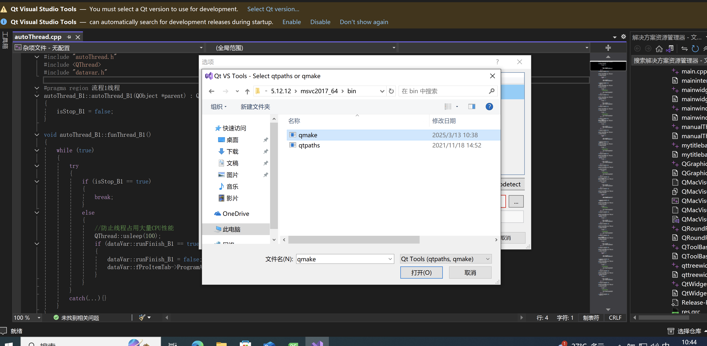

## 无法打开 QMainPro/QMacVisual/.*autoThread.cpp 这种.*开头的 cpp 文件

    原因：项目文件放在了exFAT下的移动磁盘空间，mac会自动生成._开头的隐藏文件，忽略即可

## 在 macos 和 ubuntu 系统下运行会遇到的问题

    1. 项目中大量使用了windows的路径符号\\，如果要在非windows平台运行，需要大量时间修改
    2. 调用了windows接口 include <windows>
    在mac或ubuntu则需要一定程度重构项目

    所以在vm安装win10虚拟机是比较稳妥的办法

## 工作任务的流程预测

    1. 安装虚拟机和 Windows 10。（完成）
    2. 安装 Visual Studio 2022 和 Qt（以及其他所需工具）。
        - 安装vs2022（完成）
        - 安装qt5.12.12(完成)
        - 安装opencv4.6.0
            将opencv解压到c:\
            将C:\opencv\build\x64\vc15\bin添加到环境变量

    3. 配置 OpenCV 和其他依赖库。
    4. 克隆或拷贝项目代码到虚拟机。
    5. 在 Visual Studio 或 Qt Creator 中配置、编译并运行项目。

## 确定项目是 qmake 还是 Cmake

## 运行安装程序时报错需要 Net framework4.6 以及更高版本，但是安装 4.6 版本时又提示已经安装更高版本...

最后折腾了好久发现重新启动解决了问题......

## qt 中添加 qmake 路径

遇到的问题：在最初下载 qt 时只下载了基础版，并没有下载 msvc 文件
解决办法：删掉重新下载

## ！虚拟机 c 盘磁盘空间不足

    在一开始的虚拟机分配存储空间只有60GB，安装完各种环境之后就爆满了。

### 系统自带的磁盘管理

    自带的磁盘管理貌似没有权限，不能重新分区。

### 解决办法：
