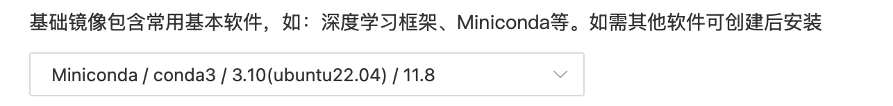
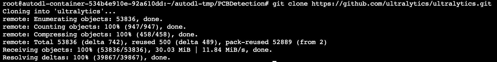

# yolov8 添加注意力机制模块，SEAttention

运行环境：autodl 的 linux


## SEAttention 代码

```python
class SEAttention(nn.Module):
    """
    Squeeze-and-Excitation (SE) 注意力模块。
    该模块用于增强通道之间的相关性，通过自适应特征权重调整提高特征表达能力。
    """

    def __init__(self, channel=512, reduction=16):
        """
        :param channel: 输入通道数
        :param reduction: 压缩率，用于降低维度
        """
        super().__init__()

        # 自适应平均池化，将特征图降维至 1×1
        self.avg_pool = nn.AdaptiveAvgPool2d(1)

        # 全连接层用于计算通道注意力权重
        self.fc = nn.Sequential(
            nn.Linear(channel, channel // reduction, bias=False),  # 降维
            nn.ReLU(inplace=True),  # ReLU 激活函数
            nn.Linear(channel // reduction, channel, bias=False),  # 还原维度
            nn.Sigmoid()  # 使用 Sigmoid 归一化权重到 [0,1]
        )

    def init_weights(self):
        """
        初始化网络权重。
        """
        for m in self.modules():
            if isinstance(m, nn.Conv2d):
                init.kaiming_normal_(m.weight, mode='fan_out')  # Kaiming 初始化
                if m.bias is not None:
                    init.constant_(m.bias, 0)
            elif isinstance(m, nn.BatchNorm2d):
                init.constant_(m.weight, 1)
                init.constant_(m.bias, 0)
            elif isinstance(m, nn.Linear):
                init.normal_(m.weight, std=0.001)  # 正态分布初始化
                if m.bias is not None:
                    init.constant_(m.bias, 0)

    def forward(self, x):
        """
        前向传播。
        :param x: 输入特征图 (batch, channel, height, width)
        :return: 经过通道注意力加权后的特征图
        """
        b, c, _, _ = x.size()  # 获取输入的 batch_size 和通道数
        y = self.avg_pool(x).view(b, c)  # 进行全局平均池化，得到通道级特征
        y = self.fc(y).view(b, c, 1, 1)  # 通过全连接层计算权重，并调整维度
        return x * y.expand_as(x)  # 对输入特征图进行通道加权
```

## 步骤

1. 将 ultralytics 下载到本地

   ```bash
   git clone https://github.com/ultralytics/ultralytics.git
    # 将外层的ultralytics文件夹命名为yolov8，防止混淆
   mv /root/autodl-tmp/PCBDetection/ultralytics /root/autodl-tmp/PCBDetection/yolov8

   ```

   

2. 在 conv.py 添加 SEAttention

   文件路径： /root/autodl-tmp/PCBDetection/yolov8/ultralytics/nn/modules/conv.py

   将上面的 SEAttention 添加到代码最下面，然后在 **all** 中添加 "SEAttention"

   ```python
   __all__ = {
       "Conv"
       "Conv2"
       # 其他...
       "SEAttention",
   }
   ```

3. module/**init**.py
   /ultralytics/nn/modules/**init**.py 文件下修改

   ```python
   from .conv import (
    CBAM,
    # 其他...
    SEAttention,
   )

   __all__ = {
    "Conv",
    "Conv2",
    # 其他
    "SEAttention",
   }
   ```

4. 修改 task.py
   ultralytics/nn/tasks.py

   ```python
   from ultralytics.nn.modules import (
   AIFI,
   C1,
   # 其他...
   SEAttention,
   )
   ```

   修改 parse_model

   ```python
    def parse_model(d, ch, verbose=True):
        ···
        for i, (f, n, m, args) in enumerate(d["backbone"] + d["head"]):
            ···
            # 添加下面两行代码
            elif m in {SEAttention}:
                args = [ch[f], *args]
            else:
                c2 = ch[f]
   ```

5. 进入目录并安装

   ```bash
       cd ultralytics
       pip install -e .
   ```

6. 添加 yaml 文件
   添加到 autodl-tmp/PCBDetection/yolov8/ultralytics/cfg/models/v8/yolov8-SEAttention.yaml

   ```yaml
   # Ultralytics YOLO ?, AGPL-3.0 license
   # YOLOv8 object detection model with P3-P5 outputs. For Usage examples see https://docs.ultralytics.com/tasks/detect

   # Parameters
   nc: 80 # number of classes
   scales: # model compound scaling constants, i.e. 'model=yolov8n.yaml' will call yolov8.yaml with scale 'n'
   # [depth, width, max_channels]
   n: [0.33, 0.25, 1024] # YOLOv8n summary
   s: [0.33, 0.50, 1024] # YOLOv8s summary
   m: [0.67, 0.75, 768] # YOLOv8m summary
   l: [1.00, 1.00, 512] # YOLOv8l summary
   x: [1.00, 1.25, 512] # YOLOv8x summary

   # YOLOv8.0n backbone
   backbone:
     # [from, repeats, module, args]
     - [-1, 1, Conv, [64, 3, 2]] # 0-P1/2
     - [-1, 1, Conv, [128, 3, 2]] # 1-P2/4
     - [-1, 3, C2f, [128, True]]
     - [-1, 1, Conv, [256, 3, 2]] # 3-P3/8
     - [-1, 6, C2f, [256, True]]
     - [-1, 1, Conv, [512, 3, 2]] # 5-P4/16
     - [-1, 6, C2f, [512, True]]
     - [-1, 1, Conv, [1024, 3, 2]] # 7-P5/32
     - [-1, 3, C2f, [1024, True]]
     - [-1, 1, SPPF, [1024, 5]] # 9
     - [-1, 1, SEAttention, [16]] # 10 (修正缩进)

   # YOLOv8.0n head
   head:
     - [-1, 1, "nn.Upsample", [None, 2, "nearest"]] # 11 (修正 nn.Upsample)
     - [[-1, 6], 1, Concat, [1]] # cat backbone P4
     - [-1, 3, C2f, [512]] # 12

     - [-1, 1, "nn.Upsample", [None, 2, "nearest"]] # 13
     - [[-1, 4], 1, Concat, [1]] # cat backbone P3
     - [-1, 3, C2f, [256]] # 15 (P3/8-small)

     - [-1, 1, Conv, [256, 3, 2]]
     - [[-1, 13], 1, Concat, [1]] # cat head P4
     - [-1, 3, C2f, [512]] # 18 (P4/16-medium)

     - [-1, 1, Conv, [512, 3, 2]]
     - [[-1, 10], 1, Concat, [1]] # cat head P5
     - [-1, 3, C2f, [1024]] # 21 (P5/32-large)

     - [[16, 19, 22], 1, Detect, [nc]] # Detect(P3, P4, P5)
   ```

7. 修改 train.py 文件

   ```python
   import sys
   sys.path.insert(0, "/root/autodl-tmp/PCBDetection/yolov8")  # 让 Python 先查找 yolov8 目录

   # 下面是你的import···

   # 修改路径为你的yaml文件
   model = YOLO("/root/autodl-tmp/PCBDetection/yolov8/ultralytics/cfg/models/v8/SEAtt_yolov8.yaml").load('yolov8n.pt')

   # Use the model
   if __name__ == '__main__':
       # Use the model
       results = model.train(data='/root/autodl-tmp/PCBDetection/datasets/PCB_DATASET/data.yaml', epochs=250, batch=4)  # 训练模型
       # 将模型转为onnx格式
       # success = model.export(format='onnx')
   ```

8. 训练

   ```python
   # 当前工作目录在train.py所在目录时
   python train.py
   ```

## 遇到的问题

### **_keyerror_**

    这个问题真的困扰了我很久......
    查了很多资料后得知，是因为使用pip install ultralytics的时候，会在环境中也下载，在训练的时候会默认读取环境中的ultralytics，而不是我们修改过的ultralytics，如果你遇到了这个问题，可以尝试步骤5 和步骤7

### **_No module named ‘ultralytics‘_**

    这个问题是由于在运行时没有把train.py脚本放在和ultralytics文件同级目录下
    |- yolov8

          |- train.py

          |- ultralytics

    解决办法：
    - 方法一：
    把train.py移动到和ultralytics同级目录，但这里的train.py使用的是相对路径

    - 方法二：
    把train.py里的路径改成绝对路径，像步骤7
